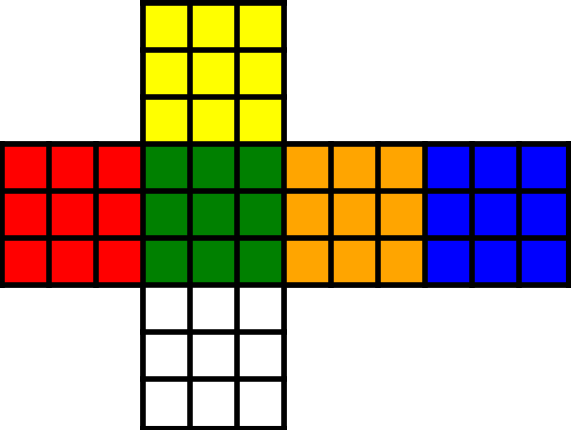
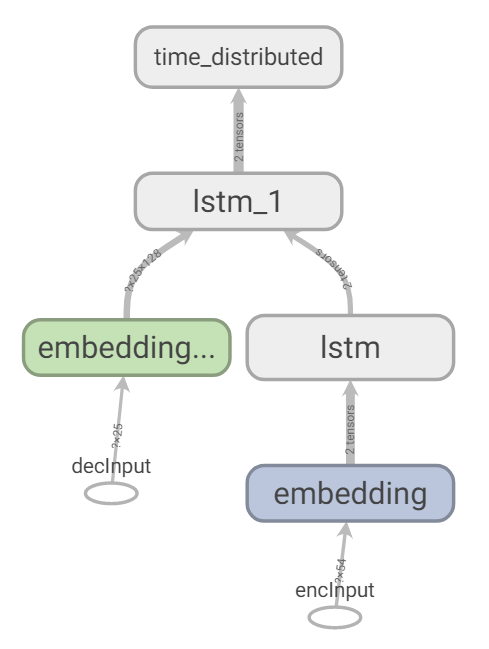

<!-- PROJECT LOGO -->
<br />
<p align="center">
    <a href="https://github.com/azychen/rubiks-cube-solver">
        
    </a>
    <h2 align="center" >Rubik's Cube Solver</h2>

  <p align="center">
    A program which generates machine-learned cube rotations, solving any scrambled Rubik's Cube.
    <br />
    <a href="https://github.com/azychen/rubiks-cube-solver">View Demo</a>
    ·
    <a href="https://github.com/azychen/rubiks-cube-solver/issues">Report Bug</a>
    ·
    <a href="https://github.com/azychen/rubiks-cube-solver/issues">Request Feature</a>
  </p>
</p>

<!-- TABLE OF CONTENTS -->

## Table of Contents

* [Background](#background)
* [Outline](#outline)
* [Roadmap](#roadmap)
  + [Cube Model](#cube-model)
  + [Scrambling](#scrambling)
  + [Generating Data](#generating-data)
  + [Training Model](#training-model)
* [Results](#results)
* [Conclusion](#conclusion)
* [Contact](#contact)
* [Acknowledgements](#acknowledgements)

<!-- BACKGROUND -->

## Background

<!-- [![Product Name Screen Shot][product-screenshot]](https://example.com) -->

With more than **43 quintillion unique combinations**, a scrambled Rubik's Cube seems impossible to solve. Yet with a simple guide, anyone can learn how to solve it. My first solve attempt took me 30 minutes, and within a week, that time was down to 5 minutes. 

What's even more impressive are "speedcubers" who can solve a scrambled cube in [less than 10 seconds!](https://www.youtube.com/watch?v=NevGDFBfQGw) They use techniques such as [CFOP](https://www.speedsolving.com/wiki/index.php/CFOP_method), [Roux](https://www.speedsolving.com/wiki/index.php/Roux_method), or [ZZ](https://www.speedsolving.com/wiki/index.php/ZZ_method), which work by memorizing many combinations of turns (known as algorithms) and when to use them.

However, we're not here to memorize a bunch of algorithms - **we want a machine to learn how to solve it.** Can we harness the power of machine learning to solve a Rubik's Cube?

<!-- OUTLINE -->

## Outline

* This program is written in [**Python**](https://www.python.org/).
* Weight learning is handled with [**TensorFlow**](https://www.tensorflow.org/).
* Tensor operations are handled with [**NumPy**](https://numpy.org/).
* Supplementary plotting is done with [**Matplotlib**](https://matplotlib.org/).
* Unit testing is done with [**PyTest**](https://docs.pytest.org/en/latest/).

<!-- ROADMAP -->

## Roadmap

<!-- CUBE MODEL -->

### Cube Model

The stickers on the cube are represented by a 6 x 3 x 3 tensor, representing the six sides with 3 rows and 3 columns of stickers. Each sticker is represented as an integer from 0 to 5. To rotate a face clockwise, the corresponding side's 3 x 3 face must be rotated clockwise. Additionally, the 12 stickers on the 4 adjacent sides must also be moved to the correct position. This applies similarly to a counter-clockwise rotation. Here's an example:

``` python
# Example: class method to rotate bottom face clockwise (D)
def rotateD(self):

    # Rotate corresponding face 
    self.stickers[0] = np.rot90(self.stickers[0], axes=(1, 0))

    # Rotate stickers of adjacent faces
    tmp = copy.copy(self.stickers[4, 2, :])
    self.stickers[4, 2, :] = copy.copy(self.stickers[3, 2, :])
    self.stickers[3, 2, :] = copy.copy(self.stickers[5, 2, :])
    self.stickers[5, 2, :] = copy.copy(self.stickers[2, 2, :])
    self.stickers[2, 2, :] = tmp
```

<!-- SCRAMBLING -->

### Scrambling

After implementing both clockwise and counter-clockwise rotations for all 6 sides (12 moves total), we can start scrambling the cube. From various sources online, a typical scramble given in a speedcubing tournament can range from 20 to 25 rotations. More specifically, moves must not cancel each other out (e.g. a clockwise rotation followed immediately by a counter-clockwise rotation on the same face), and must be optimal (e.g. 4 clockwise rotations of the same face does not change anything).

This program stores a scramble as a 20 to 25 dimensional vector of integers from 0 to 11, which index each unique cube rotation, padded to a length of 25 by a sentinel value. To store *n* scrambles, an *n* x 25 vector is used. 

``` python
# List of turns, with the letter representing the face turned clockwise
# Prime (') marks a counter-clockwise rotation
turns = ["D", "D'", "U", "U'", "F", "F'", "B", "B'", "L", "L'", "R", "R'"]
```

<!-- GENERATING DATA -->

### Generating Data

One key concept used to generate a solution is to realize that a solution to a scrambled cube is to simply backtrack on the moves used scramble the cube. For instance:

``` python
# A short example scramble
scramble = ["D", "D", "R'", "F"]
# Its corresponding solution
getSolution(scramble) = ["F'", "R", "D'", "D'"]
```

This means with every scramble we generate, we also have its corresponding solution!

<!-- TRAINING MODEL -->

### Training Model

With access to any scramble's respective solution, we can try training a model, where the stickers' location on a cube maps to the list of moves to solve it. But before we try this, we will tokenize the encoder and decoder inputs, as well converting the decoder output to a one-hot representation. 

If you have any experience in deep learning, you might see that this problem is analogous to a [**seq2seq**](https://en.wikipedia.org/wiki/Seq2seq) problem - more specifically, [**machine translation**](https://en.wikipedia.org/wiki/Machine_translation). However, rather than mapping a sequence of words to another sequence of words in a different language, we are mapping a sequence of sticker colors to a sequence of cube rotations. 

In this project, I use an LSTM encoder/decoder network generally used for machine translation. Additionally, I use the Adam optimizer for backpropagation and weight updating, along with categorical cross-entropy loss for the sparse one-hot features and labels. Here's a look at the structure:

<!-- ``` python
# LSTM encoder/decoder network 
model = keras.Sequential([
    keras.layers.LSTM(units=na),  # na = no. of units in LSTM encoder
    keras.layers.RepeatVector(n=Ty),
    keras.layers.LSTM(units=ns, return_sequences=True), # ns = no. of units in LSTM decoder
    keras.layers.TimeDistributed(keras.layers.Dense(units=outputSize, activation="softmax"))
])
model.compile(loss="categorical_crossentropy", optimizer="adam", metrics=["accuracy"])
```

Attempt 2: -->

<p align="center">
    <a href="https://github.com/azychen/rubiks-cube-solver">
        
    </a>
</p>


``` python
# LSTM encoder/decoder network, using Keras with TensorFlow backend

# Encoder
encoderInput = Input(shape=(Tx, ), name="encoderInput")
encoderEmbedding = Embedding(input_dim=inputVocabLen, output_dim=embedDim, input_length=Tx)(encoderInput)
_, h, c = LSTM(units=hiddenDim, return_state=True)(encoderEmbedding) # Get initial states for decoder

# Decoder
decoderInput = Input(shape=(Ty, ), name="decoderInput")
decoderEmbedding = Embedding(input_dim=outputVocabLen,output_dim=embedDim, input_length=Ty)(decoderInput)
decoderLSTM = LSTM(units=hiddenDim, return_sequences=True)(decoderEmbedding, initial_state=[h, c])
decoderOutput = TimeDistributed(Dense(outputVocabLen, activation="softmax"))(decoderLSTM)

# Create model with 2 inputs and 1 output
model = Model(inputs=[encoderInput, decoderInput], outputs=[decoderOutput])
model.compile(loss="categorical_crossentropy", optimizer="adam", metrics=["accuracy"])
```

<!-- ## Results

## Conclusion -->
