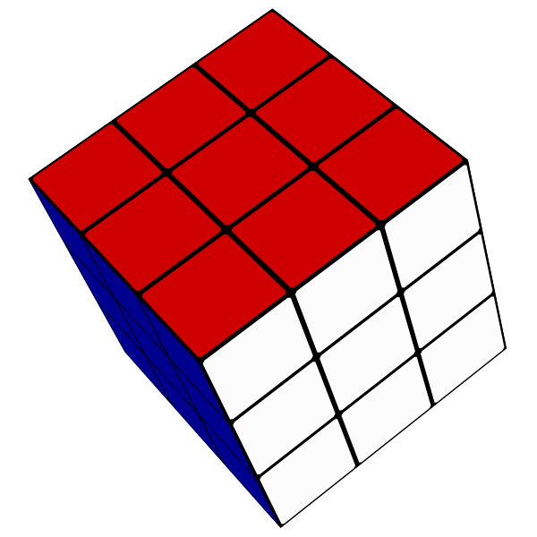
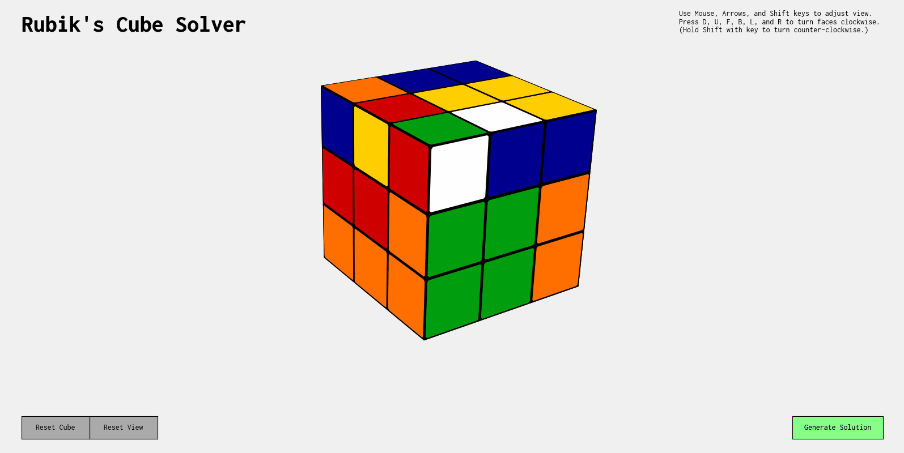

<!-- PROJECT LOGO -->
<br />
<p align="center">
    <a href="https://github.com/azychen/rubiks-cube-solver">
        
    </a>
    <h2 align="center" >AI Rubik's Cube Solver</h2>
    <br />
  <p align="center">
    A program which generates a sequence of machine-learned cube turns, solving a scrambled Rubik's Cube.
    <br />
  </p>
</p>
    <br />



<!-- TABLE OF CONTENTS -->

## Table of Contents

* [Background](#background)
* [Outline](#outline)
* [Getting Started](#getting-started)
* [Roadmap](#roadmap)
  + [Cube Model](#cube-model)
  + [Scrambling](#scrambling)
  + [Generating Data](#generating-data)
  + [Training Model](#training-model)
* [Results and Discussion](#results-and-discussion)

<!-- * [Conclusion](#conclusion) -->
<!-- * [Contact](#contact) -->
<!-- * [Acknowledgements](#acknowledgements) -->

<!-- BACKGROUND -->

## Background

<!-- [![Product Name Screen Shot][product-screenshot]](https://example.com) -->

With more than **43 quintillion unique combinations**, a scrambled Rubik's Cube seems impossible to solve. Yet with a simple guide, anyone can learn how to solve it. My first solve attempt took me 30 minutes, and within a week, that time was down to 5 minutes. 

What's even more impressive are "speedcubers" who can solve a scrambled cube in [less than 10 seconds!](https://www.youtube.com/watch?v=NevGDFBfQGw) They use techniques such as [CFOP](https://www.speedsolving.com/wiki/index.php/CFOP_method), [Roux](https://www.speedsolving.com/wiki/index.php/Roux_method), or [ZZ](https://www.speedsolving.com/wiki/index.php/ZZ_method), which work by memorizing many combinations of turns (known as algorithms) and when to use them.

However, we're not here to memorize a bunch of algorithms - **we want a machine to learn how to solve it.** Can we harness the power of machine learning to solve a Rubik's Cube?

<!-- OUTLINE -->

## Outline

* Written in [**Python**](https://www.python.org/).
* Neural network implementation with [**TensorFlow**](https://www.tensorflow.org/).
* Tensor operations with [**NumPy**](https://numpy.org/).
* GUI with [**Matplotlib**](https://matplotlib.org/) and [**MagicCube**](https://github.com/davidwhogg/MagicCube).
* Unit testing  with [**UnitTest**](https://docs.python.org/3/library/unittest.html).

<!-- DEMO -->

<!-- ## Demo -->

<!-- Getting Started -->

## Getting Started

### Install dependencies

* Python: [download link](https://www.python.org/downloads/)

``` sh
pip install tensorflow matplotlib numpy
```

### Clone repository

``` sh
git clone https://github.com/azychen/rubiks-cube-solver
```

### Run program

``` sh
python -u main.py
```

<!-- ROADMAP -->

## Roadmap

<!-- CUBE MODEL -->

### Cube Model

The stickers on the cube are represented by a 6 x 3 x 3 tensor, representing the six sides with 3 rows and 3 columns of stickers. Each sticker is represented as an integer from 0 to 5. To rotate a face clockwise, the corresponding side's 3 x 3 face must be rotated clockwise. Additionally, the 12 stickers on the 4 adjacent sides must also be moved to the correct position. This applies similarly to a counter-clockwise rotation. Here's an example:

``` python
# Example: class method to rotate bottom face clockwise (D)
def rotateD(self):
        self.stickers[0] = np.rot90(self.stickers[0], axes=(1, 0))
        self.stickers[[4, 3, 5, 2], 2] = self.stickers[[3, 5, 2, 4], 2]
```

<!-- SCRAMBLING -->

### Scrambling

After implementing clockwise, double, and counter-clockwise rotations for all 6 sides (18 moves total), we can start scrambling the cube (and eventually generate data). As any scrambled cube can be solved within [20 moves](https://www.cube20.org/#:~:text=New%20results%3A%20God's%20Number%20is,requires%20more%20than%20twenty%20moves.&text=At%20long%20last%2C%20God's%20Number%20has%20been%20shown%20to%20be%2020. "God's Number"), we will scramble the cube with no more than 25 moves. More specifically, moves must not cancel each other out (e.g. a clockwise rotation followed immediately by a counter-clockwise rotation on the same face), and must be optimal (e.g. 4 clockwise rotations of the same face does not change anything).

``` python
# List of turns, with the letter representing the face turned clockwise
# 2 marks a double rotation
# Prime (') marks a counter-clockwise rotation
turns = ["D", "D2", "D'", "U", "U2", "U'", "F", "F2", "F'",
         "B", "B2", "B'", "L", "L2", "L'", "R", "R2", "R'"]
```

<!-- GENERATING DATA -->

### Generating Data

In order to find unique solutions to generate data and train a neural network, I use [Herbert Kociemba's two-phase optimal solving algorithm](https://en.wikipedia.org/wiki/Optimal_solutions_for_Rubik%27s_Cube#Kociemba's_algorithm "Kociemba's Algorithm") to generate solutions for the scrambled cubes. Conveniently, [tcbegley's implementation of Kociemba's Algorithm](https://github.com/tcbegley/cube-solver) works very well to get solutions. For each scramble, I save the first move generated. This means with every scramble we generate, we also have moves to solve it! 

<!-- TRAINING MODEL -->

### Training Model

With access to any scramble's respective solution, we can train a model, where the stickers' location on a cube maps to the moves most likely to solve it. 

I use a fully-connected deep neural network, with the Adam optimizer for backpropagation and parameter updating, along with a sparse categorical cross-entropy loss. Here's a look at the structure:


<!-- <p align="center">

    <a href="https://github.com/azychen/rubiks-cube-solver">
      

  </a>
</p> -->

And here's the implementation with the Keras sequential model:

``` python
# Create layers
model = keras.Sequential([
    keras.layers.Input(shape=54),
    keras.layers.Dense(units=2048, activation="relu", name="dense0"),
    keras.layers.Dense(units=512, activation="relu", name="dense1"),
    keras.layers.Dense(units=128, activation="relu", name="dense2"),
    keras.layers.Dense(units=32, activation="relu", name="dense3"),
])

# Compile model
model.compile(loss="sparse_categorical_crossentropy",
              optimizer="adam", metrics=["accuracy"])
```

## Results and Discussion

After training on over 8 million training examples, the network has a validation accuracy of approximately 70%. In other words, the model can predict the next move in the solution a considerable amount of the time. In practice, this means that the model is incredibly accuracy when it comes to predicting solution sequences for scrambles less than 6-7 moves long. However, as scramble length increases beyond this, the model struggles to find accurate moves to solve the cube.

To improve results, it may suffice to simply generate more data to be fed into the model. 

<!-- 

## Conclusion -->
